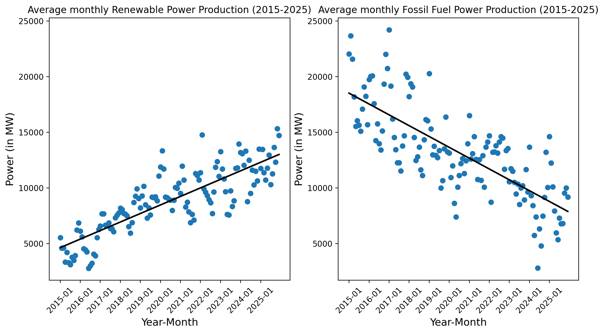
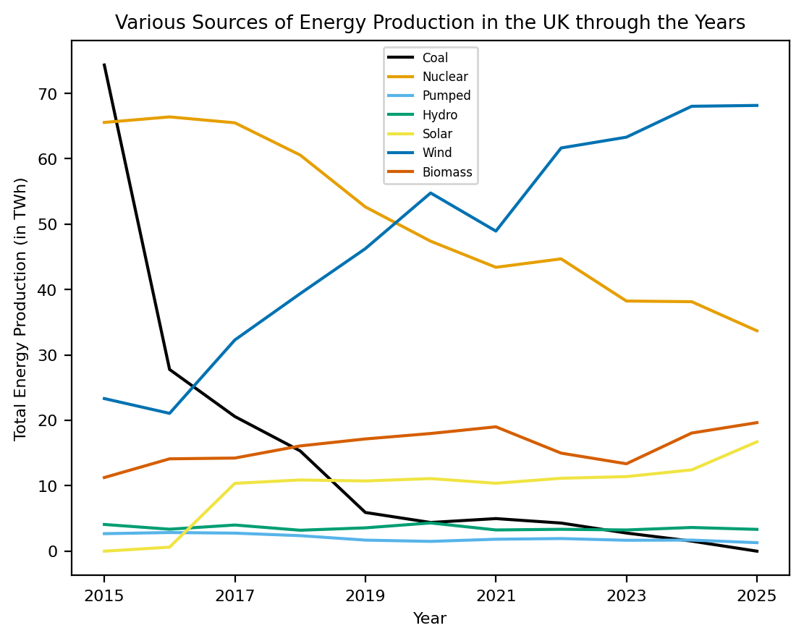
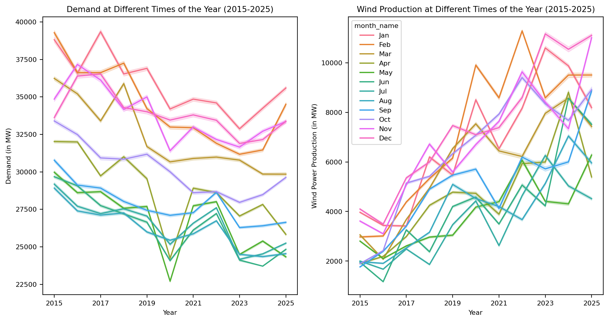
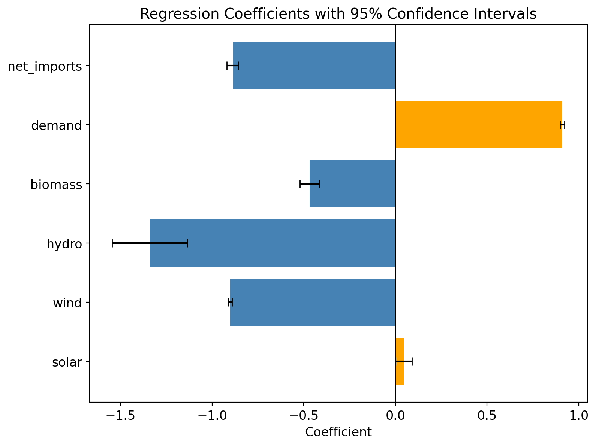
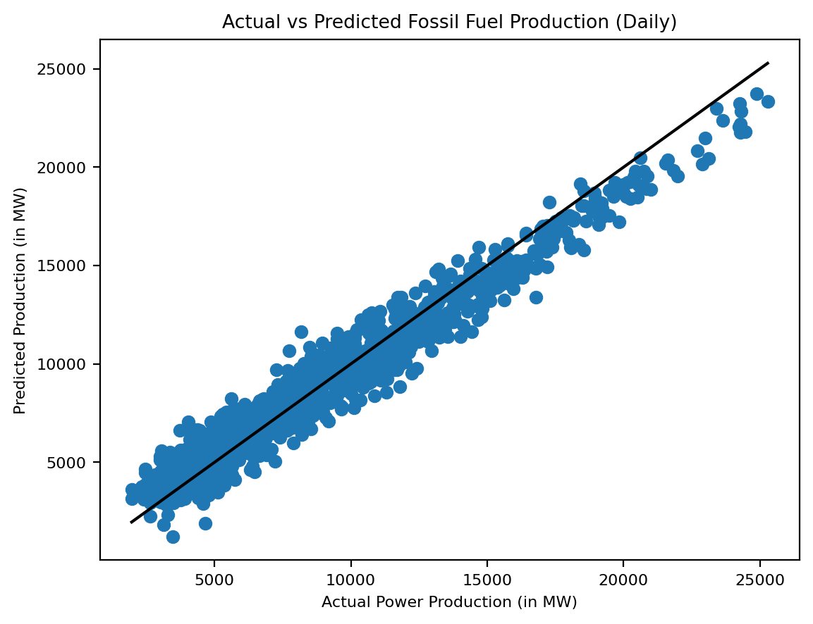

# UK Power Grid Analysis (2015–2025)

Analysis of the factors affecting fossil fuel power generation in the UK from 2015–2025,
using data from the UK National Grid sourced via Gridwatch/Elexon.

## Overview

The UK's energy mix has shifted dramatically over the past decade, with renewables
increasingly displacing fossil fuels. This project quantifies the effect of renewable
energy sources, electricity demand, net imports, and seasonality on fossil fuel
production using exploratory analysis and multiple linear regression.

## Key Findings

- Wind energy and net imports displace fossil fuels at near-identical rates (β ≈ −0.90)
- Hydropower has the strongest displacement effect among renewables (β = −1.34)
- Solar shows a borderline positive coefficient, likely reflecting multicollinearity with demand
- December, May, and June show statistically significant reductions in fossil fuel
  production relative to January
- The OLS regression model achieves R² = 0.968 on daily aggregated data

## Dataset

- **Source:** [Gridwatch](https://www.gridwatch.templar.co.uk/download.php) (data from Elexon)
- **Size:** 1,154,090 records at 5-minute intervals from 2015–2025
- **Variables:** Demand, coal, CCGT, OCGT, oil, nuclear, wind, solar, hydro, biomass,
  pumped storage, and electricity interconnectors (French, Dutch, Irish, NEMO, NSL)

## Methodology

1. **Data processing** — timestamp parsing, aggregate columns for total fossil fuel
   production, renewable production, and net imports; daily resampling to reduce
   autocorrelation
2. **Exploratory analysis** — trend visualisations, seasonal plots, and a correlation matrix
3. **Regression modelling** — OLS multiple linear regression with monthly dummy variables
   (January as baseline) using `statsmodels`

## Visualisations

### Renewable vs Fossil Fuel Production Trends (2015–2025)

### Annual Energy Production by Source

### Demand and Wind Production by Month

### Regression Coefficients with 95% Confidence Intervals

### Actual vs Predicted Fossil Fuel Production

## Limitations

- Low Durbin-Watson statistic (0.248) indicates positive autocorrelation in residuals
- High condition number (689,000) suggests multicollinearity between predictors
- Regression reflects association, not causation

